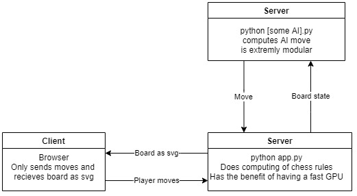
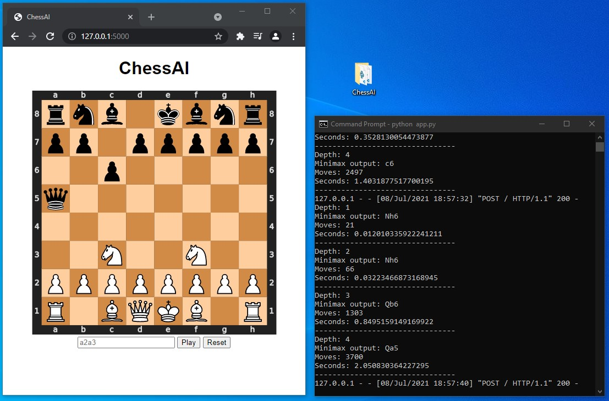

# ChessAI
ChessAI (minimax with alpha-beta pruning) implemented in Python and Flask. The goal was to build an implementation that can easily be extended with new ai algorithms. Thus, Python is used as the backend language as it allows for easy compatibility with deep learning frameworks.
The diagram describes the client-server model:

[](diagram)

## Installation
Use git or download as zip
```
git clone https://github.com/vnescape/ChessAI.git 
pip install -r requirements.txt
```

## Usage
Run and open link displayed in the output
```
python app.py
```

[](demo)
